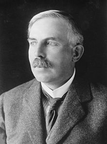
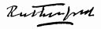

<table class="infobox vcard">
<tbody>
<tr>
<th colspan="2">

<a title="" href="https://en.wikipedia.org/wiki/The_Right_Honourable">The Right Honourable</a>

 

The Lord Rutherford of Nelson

 

<a class="mw-redirect" title="Member of the Order of Merit" href="https://en.wikipedia.org/wiki/Member_of_the_Order_of_Merit">OM</a>&nbsp;<a class="mw-redirect" title="President of the Royal Society" href="https://en.wikipedia.org/wiki/President_of_the_Royal_Society">PRS</a>&nbsp;<a class="mw-redirect" title="Honorary Fellow of the Royal Society of Edinburgh" href="https://en.wikipedia.org/wiki/Honorary_Fellow_of_the_Royal_Society_of_Edinburgh">HonFRSE</a>

</th>
</tr>
<tr>
<td colspan="2">

Ernest Rutherford

</td>
</tr>
<tr>
<td colspan="2">&nbsp;</td>
</tr>
<tr>
<th colspan="2"><a title="List of presidents of the Royal Society" href="https://en.wikipedia.org/wiki/List_of_presidents_of_the_Royal_Society">President of the Royal Society</a></th>
</tr>
<tr>
<td colspan="2"><strong>In office</strong> 1925&ndash;1930</td>
</tr>
<tr>
<th scope="row">Preceded by</th>
<td>Sir&nbsp;<a title="Charles Scott Sherrington" href="https://en.wikipedia.org/wiki/Charles_Scott_Sherrington">Charles Scott Sherrington</a></td>
</tr>
<tr>
<th scope="row">Succeeded by</th>
<td>Sir&nbsp;<a title="Frederick Gowland Hopkins" href="https://en.wikipedia.org/wiki/Frederick_Gowland_Hopkins">Frederick Gowland Hopkins</a></td>
</tr>
<tr>
<th colspan="2">Personal details</th>
</tr>
<tr>
<th scope="row">Born</th>
<td>30 August 1871 <a title="Brightwater" href="https://en.wikipedia.org/wiki/Brightwater">Brightwater</a>,&nbsp;<a title="Colony of New Zealand" href="https://en.wikipedia.org/wiki/Colony_of_New_Zealand">Colony of New Zealand</a></td>
</tr>
<tr>
<th scope="row">Died</th>
<td>19 October 1937&nbsp;(aged&nbsp;66) <a title="Cambridge" href="https://en.wikipedia.org/wiki/Cambridge">Cambridge</a>, England</td>
</tr>
<tr>
<th scope="row">Citizenship</th>
<td><a title="British subject" href="https://en.wikipedia.org/wiki/British_subject">British subject</a></td>
</tr>
<tr>
<th scope="row">Nationality</th>
<td>New Zealander</td>
</tr>
<tr>
<th scope="row">Residence</th>
<td>New Zealand, United Kingdom</td>
</tr>
<tr>
<th scope="row">Signature</th>
<td></td>
</tr>
<tr>
<td colspan="2">&nbsp;</td>
</tr>
<tr>
<th scope="row">Alma&nbsp;mater</th>
<td><a title="University of New Zealand" href="https://en.wikipedia.org/wiki/University_of_New_Zealand">University of New Zealand</a> <a title="Cavendish Laboratory" href="https://en.wikipedia.org/wiki/Cavendish_Laboratory">Cavendish Laboratory</a>,&nbsp;<a title="University of Cambridge" href="https://en.wikipedia.org/wiki/University_of_Cambridge">University of Cambridge</a></td>
</tr>
<tr>
<th scope="row">Known&nbsp;for</th>
<td>

<ul>
<li>Discovery of&nbsp;<a title="Alpha particle" href="https://en.wikipedia.org/wiki/Alpha_particle">alpha</a>&nbsp;and&nbsp;<a title="Beta particle" href="https://en.wikipedia.org/wiki/Beta_particle">beta radioactivity</a></li>
<li>Discovery of&nbsp;<a title="Atomic nucleus" href="https://en.wikipedia.org/wiki/Atomic_nucleus">atomic nucleus</a>&nbsp;(<a title="Rutherford model" href="https://en.wikipedia.org/wiki/Rutherford_model">Rutherford model</a>)</li>
<li><a title="Rutherford scattering" href="https://en.wikipedia.org/wiki/Rutherford_scattering">Rutherford scattering</a></li>
<li><a class="mw-redirect" title="Rutherford backscattering spectroscopy" href="https://en.wikipedia.org/wiki/Rutherford_backscattering_spectroscopy">Rutherford backscattering spectroscopy</a></li>
<li><a title="Proton" href="https://en.wikipedia.org/wiki/Proton">Discovery of proton</a></li>
<li><a title="Rutherford (unit)" href="https://en.wikipedia.org/wiki/Rutherford_(unit)">Rutherford (unit)</a></li>
<li><a title="Artificial disintegration" href="https://en.wikipedia.org/wiki/Artificial_disintegration">Coining the term 'artificial disintegration'</a></li>
</ul>

</td>
</tr>
<tr>
<th scope="row">Awards</th>
<td>

<ul>
<li><a title="Rumford Medal" href="https://en.wikipedia.org/wiki/Rumford_Medal">Rumford Medal</a>&nbsp;(1904)</li>
<li><a title="Nobel Prize in Chemistry" href="https://en.wikipedia.org/wiki/Nobel_Prize_in_Chemistry">Nobel Prize in Chemistry</a>&nbsp;(1908)</li>
<li><a title="Barnard Medal for Meritorious Service to Science" href="https://en.wikipedia.org/wiki/Barnard_Medal_for_Meritorious_Service_to_Science">Barnard Medal</a>&nbsp;<small>(1910)</small></li>
<li><a title="Elliott Cresson Medal" href="https://en.wikipedia.org/wiki/Elliott_Cresson_Medal">Elliott Cresson Medal</a>&nbsp;(1910)</li>
<li><a class="mw-redirect" title="Foreign Associate of the National Academy of Sciences" href="https://en.wikipedia.org/wiki/Foreign_Associate_of_the_National_Academy_of_Sciences">Foreign Associate of the National Academy of Sciences</a>&nbsp;(1911)</li>
<li><a title="Matteucci Medal" href="https://en.wikipedia.org/wiki/Matteucci_Medal">Matteucci Medal</a>&nbsp;(1913)</li>
<li><a class="mw-redirect" title="Hector Memorial Medal" href="https://en.wikipedia.org/wiki/Hector_Memorial_Medal">Hector Memorial Medal</a>&nbsp;(1916)</li>
<li><a class="mw-redirect" title="Dalton Medal" href="https://en.wikipedia.org/wiki/Dalton_Medal">Dalton Medal</a>&nbsp;(1919)</li>
<li><a title="Copley Medal" href="https://en.wikipedia.org/wiki/Copley_Medal">Copley Medal</a>&nbsp;(1922)</li>
<li><a title="Franklin Medal" href="https://en.wikipedia.org/wiki/Franklin_Medal">Franklin Medal</a>&nbsp;(1924)</li>
<li><a title="Albert Medal (Royal Society of Arts)" href="https://en.wikipedia.org/wiki/Albert_Medal_(Royal_Society_of_Arts)">Albert Medal</a>&nbsp;(1928)</li>
<li><a class="mw-redirect" title="Faraday Medal" href="https://en.wikipedia.org/wiki/Faraday_Medal">Faraday Medal</a>&nbsp;(1930)</li>
<li><a title="Wilhelm Exner Medal" href="https://en.wikipedia.org/wiki/Wilhelm_Exner_Medal">Wilhelm Exner Medal</a>&nbsp;(1936)</li>
<li><a title="Faraday Lectureship Prize" href="https://en.wikipedia.org/wiki/Faraday_Lectureship_Prize">Faraday Lectureship Prize</a>&nbsp;(1936)</li>
</ul>

</td>
</tr>
<tr>
<td colspan="2"><strong>Scientific career</strong></td>
</tr>
<tr>
<th scope="row">Fields</th>
<td class="category"><a title="Physics" href="https://en.wikipedia.org/wiki/Physics">Physics</a>&nbsp;and&nbsp;<a title="Chemistry" href="https://en.wikipedia.org/wiki/Chemistry">chemistry</a></td>
</tr>
<tr>
<th scope="row">Institutions</th>
<td>

<ul>
<li><a title="McGill University" href="https://en.wikipedia.org/wiki/McGill_University">McGill University</a></li>
<li><a title="Victoria University of Manchester" href="https://en.wikipedia.org/wiki/Victoria_University_of_Manchester">University of Manchester</a></li>
<li><a title="University of Cambridge" href="https://en.wikipedia.org/wiki/University_of_Cambridge">University of Cambridge</a></li>
</ul>

</td>
</tr>
<tr>
<th scope="row">Academic advisors</th>
<td>

<ul>
<li><a class="mw-redirect" title="Alexander Bickerton" href="https://en.wikipedia.org/wiki/Alexander_Bickerton">Alexander Bickerton</a></li>
<li><a title="J. J. Thomson" href="https://en.wikipedia.org/wiki/J._J._Thomson">J. J. Thomson</a></li>
</ul>

</td>
</tr>
<tr>
<th scope="row">Doctoral students</th>
<td>

<ul>
<li><a title="Nazir Ahmed (physicist)" href="https://en.wikipedia.org/wiki/Nazir_Ahmed_(physicist)">Nazir Ahmed</a></li>
<li><a title="Norman Alexander" href="https://en.wikipedia.org/wiki/Norman_Alexander">Norman Alexander</a></li>
<li><a title="Edward Victor Appleton" href="https://en.wikipedia.org/wiki/Edward_Victor_Appleton">Edward Victor Appleton</a></li>
<li><a title="Robert William Boyle" href="https://en.wikipedia.org/wiki/Robert_William_Boyle">Robert William Boyle</a></li>
<li><a title="James Chadwick" href="https://en.wikipedia.org/wiki/James_Chadwick">James Chadwick</a></li>
<li><a title="Rafi Muhammad Chaudhry" href="https://en.wikipedia.org/wiki/Rafi_Muhammad_Chaudhry">Rafi Muhammad Chaudhry</a></li>
<li><a title="Norman Feather" href="https://en.wikipedia.org/wiki/Norman_Feather">Norman Feather</a></li>
<li><a title="Daulat Singh Kothari" href="https://en.wikipedia.org/wiki/Daulat_Singh_Kothari">Daulat Singh Kothari</a></li>
<li><a title="Alexander McAulay" href="https://en.wikipedia.org/wiki/Alexander_McAulay">Alexander McAulay</a></li>
<li><a class="mw-redirect" title="Cecil Powell" href="https://en.wikipedia.org/wiki/Cecil_Powell">Cecil Powell</a></li>
<li><a title="Henry DeWolf Smyth" href="https://en.wikipedia.org/wiki/Henry_DeWolf_Smyth">Henry DeWolf Smyth</a></li>
<li><a title="Ernest Walton" href="https://en.wikipedia.org/wiki/Ernest_Walton">Ernest Walton</a></li>
<li><a title="Evan James Williams" href="https://en.wikipedia.org/wiki/Evan_James_Williams">Evan James Williams</a></li>
<li><a title="C. E. Wynn-Williams" href="https://en.wikipedia.org/wiki/C._E._Wynn-Williams">C. E. Wynn-Williams</a></li>
<li><a class="mw-redirect" title="Yulii Borisovich Khariton" href="https://en.wikipedia.org/wiki/Yulii_Borisovich_Khariton">Yulii Borisovich Khariton</a></li>
</ul>

</td>
</tr>
<tr>
<th scope="row">Other&nbsp;notable students</th>
<td>

<ul>
<li><a title="Edward Andrade" href="https://en.wikipedia.org/wiki/Edward_Andrade">Edward Andrade</a></li>
<li><a title="Patrick Blackett" href="https://en.wikipedia.org/wiki/Patrick_Blackett">Patrick Blackett</a></li>
<li><a title="Niels Bohr" href="https://en.wikipedia.org/wiki/Niels_Bohr">Niels Bohr</a></li>
<li><a title="Bertram Boltwood" href="https://en.wikipedia.org/wiki/Bertram_Boltwood">Bertram Boltwood</a></li>
<li><a title="Harriet Brooks" href="https://en.wikipedia.org/wiki/Harriet_Brooks">Harriet Brooks</a></li>
<li><a title="Edward Bullard" href="https://en.wikipedia.org/wiki/Edward_Bullard">Teddy Bullard</a></li>
<li><a title="John Cockcroft" href="https://en.wikipedia.org/wiki/John_Cockcroft">John Cockcroft</a></li>
<li><a title="Charles Galton Darwin" href="https://en.wikipedia.org/wiki/Charles_Galton_Darwin">Charles Galton Darwin</a></li>
<li><a title="Charles Drummond Ellis" href="https://en.wikipedia.org/wiki/Charles_Drummond_Ellis">Charles Drummond Ellis</a></li>
<li><a title="Kazimierz Fajans" href="https://en.wikipedia.org/wiki/Kazimierz_Fajans">Kazimierz Fajans</a></li>
<li><a title="Hans Geiger" href="https://en.wikipedia.org/wiki/Hans_Geiger">Hans Geiger</a></li>
<li><a title="Otto Hahn" href="https://en.wikipedia.org/wiki/Otto_Hahn">Otto Hahn</a></li>
<li><a title="Douglas Hartree" href="https://en.wikipedia.org/wiki/Douglas_Hartree">Douglas Hartree</a></li>
<li><a title="Pyotr Kapitsa" href="https://en.wikipedia.org/wiki/Pyotr_Kapitsa">Pyotr Kapitsa</a></li>
<li><a title="George Laurence" href="https://en.wikipedia.org/wiki/George_Laurence">George Laurence</a></li>
<li><a title="Iven Mackay" href="https://en.wikipedia.org/wiki/Iven_Mackay">Iven Mackay</a></li>
<li><a title="Ernest Marsden" href="https://en.wikipedia.org/wiki/Ernest_Marsden">Ernest Marsden</a></li>
<li><a title="Mark Oliphant" href="https://en.wikipedia.org/wiki/Mark_Oliphant">Mark Oliphant</a></li>
<li><a title="Thomas Royds" href="https://en.wikipedia.org/wiki/Thomas_Royds">Thomas Royds</a></li>
<li><a title="Frederick Soddy" href="https://en.wikipedia.org/wiki/Frederick_Soddy">Frederick Soddy</a></li>
</ul>

</td>
</tr>
<tr>
<th scope="row">Influenced</th>
<td>

<ul>
<li><a title="Henry Moseley" href="https://en.wikipedia.org/wiki/Henry_Moseley">Henry Moseley</a></li>
<li><a title="Hans Geiger" href="https://en.wikipedia.org/wiki/Hans_Geiger">Hans Geiger</a></li>
<li><a title="Albert Beaumont Wood" href="https://en.wikipedia.org/wiki/Albert_Beaumont_Wood">Albert Beaumont Wood</a></li>
</ul>

</td>
</tr>
</tbody>
</table>
 

<strong>Ernest Rutherford, 1st Baron Rutherford of Nelson</strong>,&nbsp;<a class="mw-redirect" title="Member of the Order of Merit" href="https://en.wikipedia.org/wiki/Member_of_the_Order_of_Merit">OM</a>,&nbsp;<a title="Fellow of the Royal Society" href="https://en.wikipedia.org/wiki/Fellow_of_the_Royal_Society">FRS</a>,&nbsp;<a class="mw-redirect" title="Honorary Fellow of the Royal Society of Edinburgh" href="https://en.wikipedia.org/wiki/Honorary_Fellow_of_the_Royal_Society_of_Edinburgh">HonFRSE</a>&nbsp;(30 August 1871&nbsp;&ndash; 19 October 1937) was a New Zealand&nbsp;<a title="Physicist" href="https://en.wikipedia.org/wiki/Physicist">physicist</a>&nbsp;who came to be known as the father of&nbsp;<a title="Nuclear physics" href="https://en.wikipedia.org/wiki/Nuclear_physics">nuclear physics</a>.&nbsp;<em><a title="Encyclop&aelig;dia Britannica" href="https://en.wikipedia.org/wiki/Encyclop%C3%A6dia_Britannica">Encyclop&aelig;dia Britannica</a></em>&nbsp;considers him to be the greatest experimentalist since&nbsp;<a title="Michael Faraday" href="https://en.wikipedia.org/wiki/Michael_Faraday">Michael Faraday</a>&nbsp;(1791&ndash;1867).

In early work, Rutherford discovered the concept of radioactive&nbsp;<a title="Half-life" href="https://en.wikipedia.org/wiki/Half-life">half-life</a>, the radioactive element radon,&nbsp;and differentiated and named&nbsp;<a title="Alpha decay" href="https://en.wikipedia.org/wiki/Alpha_decay">alpha</a>&nbsp;and&nbsp;<a title="Beta particle" href="https://en.wikipedia.org/wiki/Beta_particle">beta radiation</a>.&nbsp;This work was performed at&nbsp;<a title="McGill University" href="https://en.wikipedia.org/wiki/McGill_University">McGill University</a>&nbsp;in&nbsp;<a title="Montreal" href="https://en.wikipedia.org/wiki/Montreal">Montreal</a>, Quebec, Canada. It is the basis for the&nbsp;<a title="Nobel Prize in Chemistry" href="https://en.wikipedia.org/wiki/Nobel_Prize_in_Chemistry">Nobel Prize in Chemistry</a>&nbsp;he was awarded in 1908 "for his investigations into the disintegration of the elements, and the chemistry of radioactive substances",&nbsp;for which he was the first Canadian and Oceanian Nobel laureate.

Rutherford moved in 1907 to the&nbsp;<a title="Victoria University of Manchester" href="https://en.wikipedia.org/wiki/Victoria_University_of_Manchester">Victoria University of Manchester</a>&nbsp;(today&nbsp;<a title="University of Manchester" href="https://en.wikipedia.org/wiki/University_of_Manchester">University of Manchester</a>) in the UK, where he and&nbsp;<a title="Thomas Royds" href="https://en.wikipedia.org/wiki/Thomas_Royds">Thomas Royds</a>&nbsp;proved that alpha radiation is&nbsp;<a title="Helium" href="https://en.wikipedia.org/wiki/Helium">helium</a>&nbsp;nuclei.&nbsp;Rutherford performed his most famous work after he became a Nobel laureate.&nbsp;In 1911, although he could not prove that it was positive or negative,&nbsp;he theorized that atoms have their charge concentrated in a very small&nbsp;<a title="Atomic nucleus" href="https://en.wikipedia.org/wiki/Atomic_nucleus">nucleus</a>,&nbsp;and thereby pioneered the&nbsp;<a title="Rutherford model" href="https://en.wikipedia.org/wiki/Rutherford_model">Rutherford model</a>&nbsp;of the&nbsp;<a title="Atom" href="https://en.wikipedia.org/wiki/Atom">atom</a>, through his discovery and interpretation of&nbsp;<a title="Rutherford scattering" href="https://en.wikipedia.org/wiki/Rutherford_scattering">Rutherford scattering</a>&nbsp;by the&nbsp;<a class="mw-redirect" title="Gold foil experiment" href="https://en.wikipedia.org/wiki/Gold_foil_experiment">gold foil experiment</a>&nbsp;of&nbsp;<a title="Hans Geiger" href="https://en.wikipedia.org/wiki/Hans_Geiger">Hans Geiger</a>&nbsp;and&nbsp;<a title="Ernest Marsden" href="https://en.wikipedia.org/wiki/Ernest_Marsden">Ernest Marsden</a>. He performed the first artificially induced&nbsp;<a title="Nuclear reaction" href="https://en.wikipedia.org/wiki/Nuclear_reaction">nuclear reaction</a>&nbsp;in 1917 in experiments where nitrogen nuclei were bombarded with alpha particles. As a result, he discovered the emission of a subatomic particle which, in 1919, he called the "hydrogen atom" but, in 1920, he more accurately named the&nbsp;<a title="Proton" href="https://en.wikipedia.org/wiki/Proton">proton</a>.

Rutherford became Director of the Cavendish Laboratory at the University of Cambridge in 1919. Under his leadership the&nbsp;<a title="Neutron" href="https://en.wikipedia.org/wiki/Neutron">neutron</a>&nbsp;was discovered by&nbsp;<a title="James Chadwick" href="https://en.wikipedia.org/wiki/James_Chadwick">James Chadwick</a>&nbsp;in 1932 and in the same year the first experiment to split the nucleus in a fully controlled manner was performed by students working under his direction,&nbsp;<a title="John Cockcroft" href="https://en.wikipedia.org/wiki/John_Cockcroft">John Cockcroft</a>&nbsp;and&nbsp;<a title="Ernest Walton" href="https://en.wikipedia.org/wiki/Ernest_Walton">Ernest Walton</a>. After his death in 1937, he was buried in&nbsp;<a title="Westminster Abbey" href="https://en.wikipedia.org/wiki/Westminster_Abbey">Westminster Abbey</a>&nbsp;near&nbsp;<a class="mw-redirect" title="Sir Isaac Newton" href="https://en.wikipedia.org/wiki/Sir_Isaac_Newton">Sir Isaac Newton</a>. The chemical element&nbsp;<a title="Rutherfordium" href="https://en.wikipedia.org/wiki/Rutherfordium">rutherfordium</a>&nbsp;(element 104) was named after him in 1997.

 

<strong> Publications: </strong>

<ul>

 <li><a target="_blank" href="https://github.com/manjunath5496/Ernest-Rutherford-Papers/blob/master/tst(144).pdf" style="text-decoration:none;">Radiations from Radioactive Substances</a></li>
                            
 <li><a target="_blank" href="https://github.com/manjunath5496/Ernest-Rutherford-Papers/blob/master/tst(145).pdf" style="text-decoration:none;">Radioactive substances and their radiations</a></li>

<li><a target="_blank" href="https://github.com/manjunath5496/Ernest-Rutherford-Papers/blob/master/tst(146).pdf" style="text-decoration:none;">Radioactive Transformations</a></li>
<li><a target="_blank" href="https://github.com/manjunath5496/Ernest-Rutherford-Papers/blob/master/tst(229).pdf" style="text-decoration:none;">The Chemical Nature of the Alpha Particles from Radioactive Substances [Nobel Lecture]</a></li>
                          
</ul>

 
